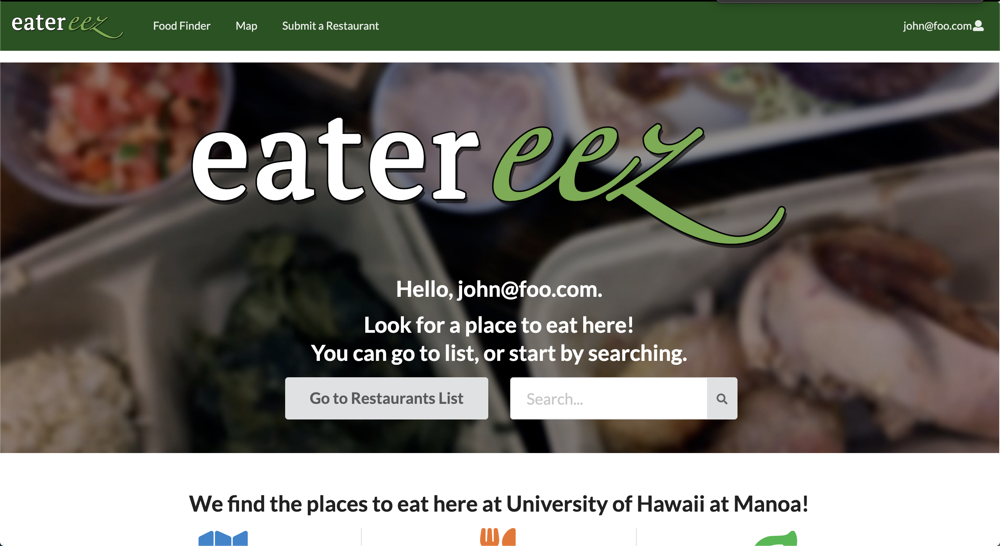
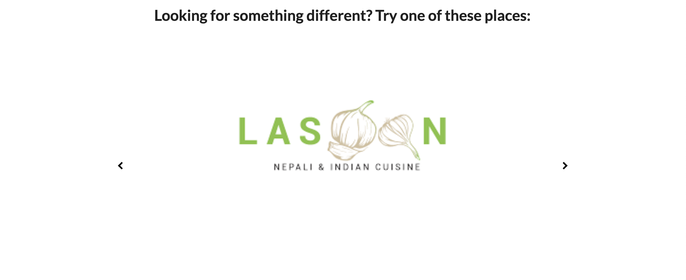
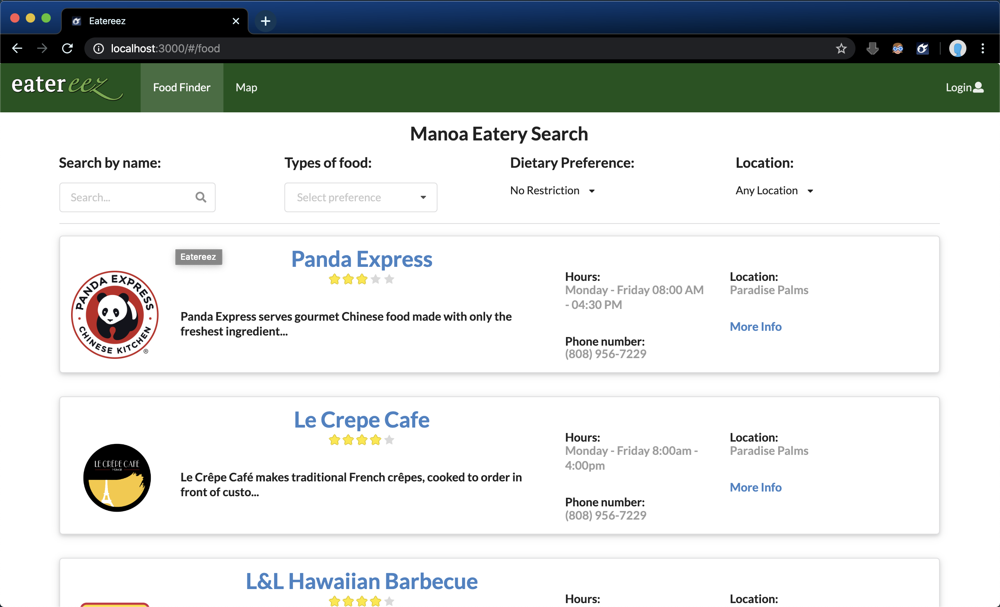
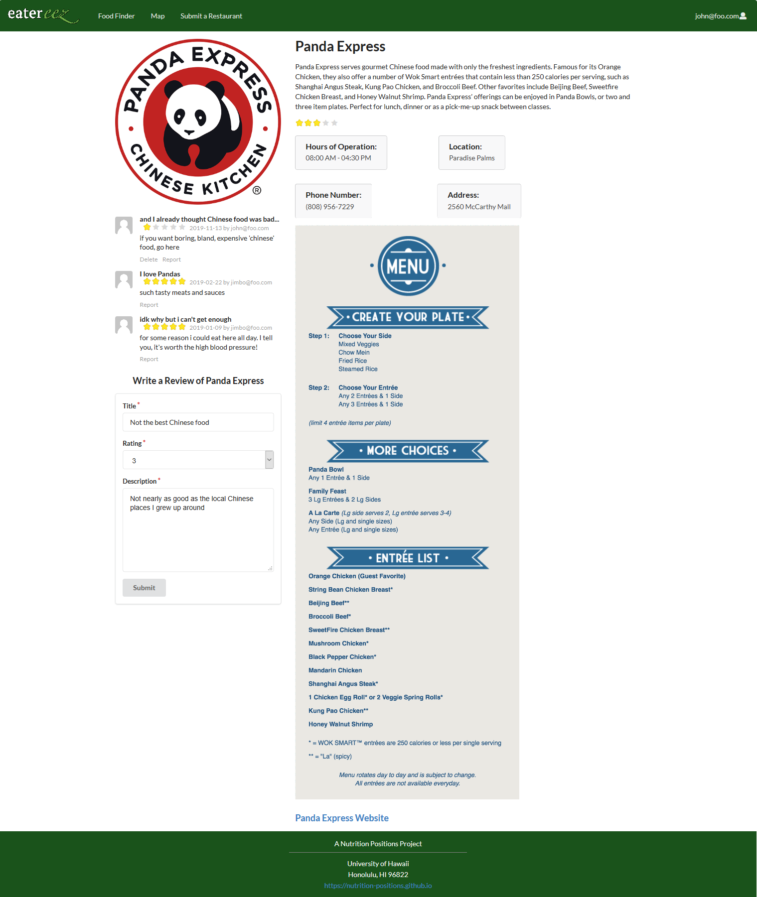

Hungry while at UH? Don't know what to eat or can't decide? Eateerez is for you. Eateerez is designed to help students discover new places to fill their cravings. This app is designed by studens for students so if users login, they can rate and provide feedback for their favorite restaurant. Eatereez also contains a map in case you get lost.

Eateerez's github repo can be found [here](https://github.com/nutrition-positions/eatereez), along with the project homepage [here](https://github.com/nutrition-positions/nutrition-positions.github.io).

<h1>Here's how Eateerez Work</h1>

Here at the front page, we have a button to the restaurant list and a search bar. This search bar is allows users to quickly start searching right away. The front page also contain information about the site with clickable icons and text. 

Below the home page contains an image carousel. It will contain a random set of three restaurant logos. This is design to help users choose a new place if they are unable to decide.

Here is the heart of the application as it alows the user to browse through the restaurant list. There filters at the top such that users can scope in on what, where, and even what diet they prefer. On this page restaurants will show part of their information such as title, description, open times, and amount of stars.

When a restaurant is clicked on, users then can read the entire description of the restauarant. The page also contains the menu and reviews of other users. 

<h1>My contribution to Eateerez</h1>

There two components that I have mainly worked on throughout this project. One of them is the Landing Page. I have put much thought into designing the page to contain everything the user would see when they first enter our sight. This is why I created a button and a search bar as they are most likely to click on those two components first. Then, below contains information about the site. These too are also clickable to show the user what the text means. Third, is the Image Carousel, which took a bit longer than expected. However, I thought it be a great addition to our sites since I could have random restaurants in the image carousel. The last component is a reminder to the user to login such that they can access other features such as making reviews.

The other component I worked on is the List Restaurant. This page is important as it is the main page the user will use when searching for the restaurant. Most of my coding was in the filters. I've learned a great deal of using input and dropdown menus in developing this page. 

Overall I had great experience doing this project. As this is my introduction to JavaScript, MongoDB, CSS, and HTML, there a lot to learn. I plan to use this knowledge for future developments.
